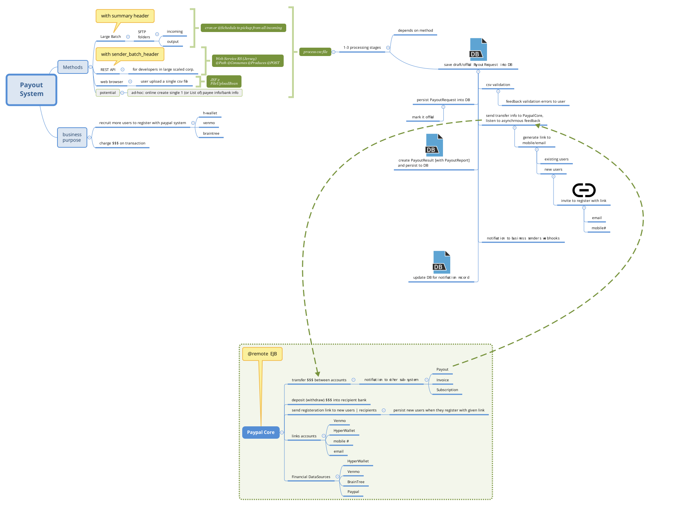

Demo Payout System Draft
===============================
### A tiny demo to show an idea how a payout system utilizes the tech stack 

## High Level Design Overview - zoom in this HD svg picture

### tech knowledge outline
- JPA 2
    - [DATA MODEL](src/main/java/technology/touchmars/model)
    - [Repository](src/main/java/technology/touchmars/repository)  
- JSF 2
    - [FileUpload Backing Bean](src/main/java/technology/touchmars/jsf/FileUploadBean.java)
    - [validator](src/main/java/technology/touchmars/validator)
- [config](src/main/java/technology/touchmars/config)  
- [Core Java Utils](src/main/java/technology/touchmars/util) 
    - [CsvReader](src/main/java/technology/touchmars/util/CsvReader.java)
    - [FileUtil](src/main/java/technology/touchmars/util/FileUtil.java)
    - [PayoutRequestConverter](src/main/java/technology/touchmars/util/PayoutRequestConverter.java)
    - [StringUtil](src/main/java/technology/touchmars/util/StringUtil.java) 
- [Web Service SOAP](src/main/java/technology/touchmars/webservice)
- [REST API](src/main/java/technology/touchmars/api/RestSample.java) 
- [WEB-INF](src/main/webapp/WEB-INF)

### Note
- It only demonstrates the idea how a Payout system prototype works with tech stack (JSF 2, JPA 2, Service Layer, etc). 
- UI part needs more work as time runs out.
- need to download [wildfly](https://www.wildfly.org/downloads/) version `20+` to run it
- run the demo command `$WILDFLY_HOME/bin/standalone.sh && mvn clean install wildfly:deploy`